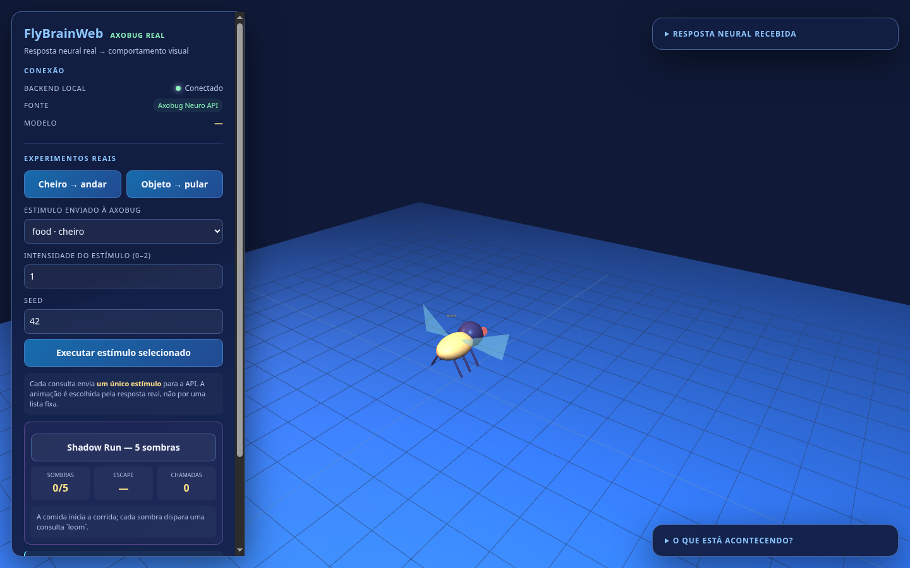

# NaMosca

## Explorando um cérebro de *Drosophila melanogaster* através de simulação neural e comportamento emergente

**NaMosca** é um laboratório experimental e visual para explorar uma pergunta:

> **O que acontece quando a arquitetura neural de uma mosca real é transformada em uma simulação computacional e conectada a um ambiente interativo?**

O projeto utiliza a **Neuro API da Axobug**, que disponibiliza respostas de um modelo computacional baseado no **FlyWire v783**, utilizando uma rede de neurônios *Leaky Integrate-and-Fire* (LIF).

A atividade neural retornada pela simulação é transformada em comandos comportamentais e visualizada através de uma *Drosophila* 3D.

O objetivo do projeto não é criar uma IA que imite uma mosca, mas explorar a relação entre:

```text
connectome -> atividade neural -> sinais motores -> comportamento
```



> **Nota importante:** a animação é uma visualização dos comandos `drive`
> devolvidos pelo modelo. Ela não afirma que um estímulo sempre produz aquele
> comportamento em uma mosca biológica real.

---

## Motivação

Nos últimos anos, a neurociência computacional passou de modelos altamente abstratos para reconstruções cada vez mais detalhadas de circuitos biológicos reais.

O projeto **FlyWire** representa um dos principais exemplos dessa evolução: a reconstrução do conectoma de uma *Drosophila melanogaster* adulta identificou aproximadamente **139 mil neurônios e milhões de conexões sinápticas**.

O NaMosca parte dessa evolução tecnológica para criar uma interface experimental acessível.

Em vez de observar apenas uma tabela de neurônios ou uma representação estática do conectoma, o projeto permite experimentar estímulos e observar como as respostas produzidas pelo modelo podem ser convertidas em comportamento visual.

---

## Arquitetura

O fluxo principal do NaMosca é:

```text
                         ESTIMULO
                            |
                            v
                    +----------------+
                    |    NaMosca     |
                    |    Frontend    |
                    +-------+--------+
                            |
                            | HTTP
                            v
                    +----------------+
                    |     FastAPI    |
                    |     Backend    |
                    +-------+--------+
                            |
                            | POST
                            v
                    +----------------+
                    |     Axobug     |
                    |   Neuro API    |
                    +-------+--------+
                            |
                            v
                    Modelo baseado no FlyWire
                            |
                            v
                    Rede LIF com spikes
                            |
                            v
                    Atividade neural
                       /         \
                      v           v
                 channels        drive
                      |           |
                      |           v
                      |      comportamento
                      |           |
                      +-----+-----+
                            |
                            v
                     Drosophila 3D
```

A aplicação não executa o conectoma completo do FlyWire localmente.

Nesta versão, a simulação neural principal é realizada pelo serviço da Axobug. O NaMosca funciona como uma camada experimental e de visualização sobre essa infraestrutura.

---

## O que acontece durante um experimento?

Um experimento começa com um estímulo.

Por exemplo:

```json
{
  "stimulus": "loom",
  "intensity": 1,
  "duration_ms": 100,
  "seed": 42
}
```

O backend envia o estímulo para a Neuro API.

A API retorna informações como:

```json
{
  "model": "flywire-v783-pruned-lif-v1",
  "total_spikes": 5763,
  "responding_neurons": 682,
  "channels": {
    "walk": 3.33,
    "escape": 185
  },
  "drive": {
    "walk": 0.42,
    "escape": 1
  }
}
```

O NaMosca então utiliza esses valores para controlar a representação visual da mosca.

Por exemplo:

```text
loom
  |
  v
atividade neural
  |
  v
escape = 1.0
  |
  v
pulo
```

É importante distinguir:

- **`channels`**: atividade neural retornada pelo modelo;
- **`spikes`**: eventos de disparo produzidos pela simulação;
- **`drive`**: sinais comportamentais normalizados disponibilizados pela API.

O comportamento visual apresentado pelo NaMosca é uma **interpretação computacional da saída do modelo**, e não uma afirmação de que uma mosca biológica necessariamente apresentaria exatamente aquele comportamento diante do mesmo estímulo.

---

## Estímulos

O projeto permite experimentar diferentes estímulos disponibilizados pela API:

| Estímulo | ID | Experimento |
|---|---|---|
| Doce | `sugar` | alimentação |
| Sombra | `loom` | escape |
| Alimento | `food` | locomoção |
| Toque | `touch` | resposta sensorial |
| Som | `song` | resposta auditiva |
| Feromônio | `pheromone` | resposta olfativa |
| Cor | `colour` | resposta visual |
| Umidade | `humid` | resposta sensorial |
| Temperatura | `heat` | resposta sensorial |
| Amargo | `bitter` | gustação |
| Controle | `none` | ausência de estímulo |

Para experimentos comparativos, o mesmo `seed` pode ser utilizado enquanto apenas o estímulo ou sua intensidade é alterado.

Cada consulta envia um único estímulo por vez.

A animação não segue uma tabela fixa de comportamento para cada estímulo. Ela é interpretada a partir dos valores `drive` retornados pela API.

---

## Shadow Run

O **Shadow Run** é o experimento principal do projeto.

Ele reproduz uma situação simples de ameaça:

```text
mosca correndo -> sombra se aproximando ->loom
                                      |
                                      v
                              atividade neural
                                      |
                                      v
                                drive.escape
                                      |
                                      v
                                   pulo
```

O experimento funciona da seguinte maneira:

1. `food` estabelece o estado de locomoção;
2. uma sombra se aproxima da mosca;
3. o estímulo `loom` é enviado;
4. a resposta `escape` é obtida;
5. o valor retornado controla a intensidade do salto;
6. o processo é repetido para múltiplos obstáculos.

Uma execução completa utiliza seis chamadas à API:

```text
1 x food
5 x loom
```

A interface apresenta:

- quantidade de sombras superadas;
- intensidade da resposta de escape;
- número de chamadas realizadas;
- atividade neural;
- resposta JSON;
- comportamento da mosca em 3D.

A simulação da corrida e da animação é local. A resposta neural e os valores de `drive` vêm da API.

---

## O que é real e o que é simulado?

Esta distinção é fundamental para o projeto.

### Dados e modelos externos

O projeto utiliza:

- dados e nomenclaturas derivados do ecossistema FlyWire;
- snapshots estáticos do FAFB v783 para a primeira sub-rede local;
- modelo computacional disponibilizado pela Axobug enquanto a migração local
  está em andamento;
- arquitetura neural baseada em LIF;
- respostas neurais produzidas pela Neuro API.

### Implementação do NaMosca

O projeto implementa:

- interface experimental;
- seleção de estímulos;
- comunicação com a API;
- backend/proxy FastAPI;
- ingestão em streaming dos exports FAFB;
- interpretação dos sinais `drive`;
- visualização 3D;
- Shadow Run;
- histórico de experimentos;
- visualização das respostas JSON;
- gráficos de atividade.

### O que o projeto não afirma

O NaMosca não afirma que:

- o cérebro completo da mosca está sendo executado localmente;
- cada neurônio individual está sendo visualizado no frontend;
- o comportamento visual reproduz fielmente uma mosca biológica;
- `drive.escape = 1.0` representa diretamente uma variável biológica mensurada;
- uma única simulação computacional constitui uma reprodução completa do comportamento animal.

Essas limitações são importantes para manter a distinção entre **dados biológicos, modelo computacional e visualização experimental**.

## Primeira sub-rede FlyWire local

A ingestão dos produtos estáticos do FAFB v783 já foi implementada. A
primeira sub-rede gerada contém 800 neurônios e 4.000 conexões do neuropilo
`ME_L`, com:

- posições dos somas extraídas dos arquivos SWC;
- `root_id` como chave de junção;
- tipos celulares do `consolidated_cell_types.csv.gz`;
- previsões de neurotransmissor do `neurons.csv.gz`;
- arestas e contagens sinápticas do FlyWire.

O JSON gerado está em `data/flywire/me_left_flywire_graph.json` e é ignorado
pelo Git. O backend já consegue carregá-lo e executar o LIF local. A
conversão de `syn_count` para peso e o atraso de 1 ms são hipóteses
computacionais explícitas, não medidas sinápticas diretas.

O comando de preparação e a validação dos arquivos estão em
[`docs/FLYWIRE_PREPARATION.md`](docs/FLYWIRE_PREPARATION.md).

---

## Executando localmente

### Requisitos

- Python 3.11+
- pip
- navegador moderno

### 1. Clone o projeto

```bash
git clone https://github.com/willianctti/namosca.git
cd namosca
```

### 2. Inicie o backend

```bash
cd backend

python3 -m venv .venv
source .venv/bin/activate

python -m pip install -r requirements.txt

python main.py
```

O backend estará disponível em:

```text
http://localhost:8000
```

### 3. Inicie o frontend

Em outro terminal:

```bash
cd frontend
python3 -m http.server 8080
```

Acesse:

```text
http://localhost:8080
```

A pasta `frontend` é estática e não precisa de Node ou etapa de build.

---

## API local

### Health check

```bash
curl http://localhost:8000/api/health
```

### Providers

```bash
curl http://localhost:8000/api/providers
```

### Executar um estímulo

```bash
curl -X POST \
  'http://localhost:8000/api/axobug/run?view=drive' \
  -H 'Content-Type: application/json' \
  -d '{
    "stimulus": "loom",
    "intensity": 1,
    "duration_ms": 100,
    "seed": 42
  }'
```

### Endpoints

| Método | Endpoint | Função |
|---|---|---|
| `GET` | `/api/health` | saúde do backend |
| `GET` | `/api/providers` | fontes disponíveis |
| `POST` | `/api/axobug/run` | chamada real à Neuro API |
| `GET` | `/api/network` | reservado para dados FlyWire |
| `WS` | `/ws/simulation` | reservado para integração futura |

---

## Reprodutibilidade

Um dos objetivos futuros do projeto é tornar os experimentos progressivamente mais reprodutíveis.

Atualmente, alguns parâmetros podem ser controlados diretamente:

```text
stimulus
intensity
duration_ms
seed
```

O uso de um `seed` fixo permite comparar diferentes estímulos sob condições equivalentes, quando suportado pelo modelo/API.

Experimentos futuros deverão registrar também:

- versão do modelo;
- versão dos dados do connectome;
- parâmetros da simulação;
- timestamp;
- número de neurônios responsivos;
- número de spikes;
- sinais de saída;
- condições iniciais;
- resultados comportamentais.

O mapa 3D de neurônios e sinapses reais é a próxima etapa. A ingestão local
já foi preparada e uma primeira sub-rede `ME_L` foi gerada; o guia completo
está em [`docs/FLYWIRE_PREPARATION.md`](docs/FLYWIRE_PREPARATION.md).

---

## Roadmap

O NaMosca foi pensado como uma plataforma experimental incremental.

### Fase 1 — Interface experimental

- [x] Integração com a Neuro API
- [x] Backend FastAPI
- [x] Visualização 3D
- [x] Estímulos
- [x] Shadow Run
- [x] Histórico de experimentos
- [x] Visualização de respostas
- [x] Gráficos de atividade

### Fase 2 — Connectome

- [x] Obter dados estáticos autorizados do FlyWire
- [x] Parser dos dados oficiais para sub-redes
- [x] Mapear root IDs
- [x] Mapear posições dos somas
- [x] Mapear conexões e tipos celulares
- [ ] Visualizar neurônios em 3D
- [ ] Visualizar sinapses
- [ ] Explorar sub-redes específicas

### Fase 3 — Simulação local

- [x] Implementar simulação LIF local sobre sub-redes reais
- [x] Executar a primeira sub-rede do connectome
- [ ] Comparar resultados locais com a API
- [ ] Instrumentar spikes individualmente no frontend
- [ ] Medir desempenho
- [ ] Reproduzir circuitos motores específicos

### Fase 4 — Neurociência computacional experimental

- [ ] Associar circuitos a comportamentos
- [ ] Experimentar ablação de neurônios
- [ ] Comparar diferentes modelos neuronais
- [ ] Investigar plasticidade
- [ ] Estudar propagação de atividade
- [ ] Criar experimentos reproduzíveis

### Fase 5 — Sistemas incorporados

Uma direção de pesquisa futura é conectar a atividade neural simulada a um agente físico:

```text
        ambiente
           |
           v
       sensores
           |
           v
      connectome
           |
         spikes
           |
           v
      neurônios motores
           |
           v
        atuadores
           |
           v
         robo
           |
           +----------> ambiente
```

Essa arquitetura permitiria investigar a transição:

```text
connectome -> dinâmica neural -> controle motor -> comportamento físico
```

---

## Direção de pesquisa

O NaMosca também serve como base experimental para investigar uma questão maior:

> **Até que ponto a estrutura de um connectome biológico pode ser convertida em um sistema computacional capaz de produzir comportamento?**

O projeto está inserido em uma interseção entre:

- Connectomics
- Computational Neuroscience
- Spiking Neural Networks
- Neuromorphic Computing
- Artificial Life
- Robotics
- Embodied AI

Uma linha futura de investigação é comparar diferentes níveis de abstração:

```text
        CONNECTOME
            |
            v
     neurônios LIF
            |
            v
      spikes / SNN
            |
            v
     circuitos motores
            |
            v
       comportamento
```

Isso permite estudar não apenas **quantos neurônios existem**, mas como a **organização das conexões** influencia o comportamento produzido.

---

## Limitações

O NaMosca é um projeto experimental.

Atualmente:

- a interface principal e o Shadow Run ainda usam a infraestrutura da Axobug;
- a primeira sub-rede FlyWire local já pode ser executada pelo backend LIF, mas ainda não é o modo visual padrão do frontend;
- a visualização 3D não representa individualmente todos os neurônios;
- o peso sináptico e o atraso usados na primeira sub-rede são hipóteses computacionais, não medidas biológicas diretas;
- os sinais `drive` são abstrações fornecidas pelo modelo Axobug;
- comportamento visual não deve ser interpretado como validação biológica;
- resultados do modelo não substituem experimentos com organismos vivos.

Essas limitações fazem parte da metodologia e devem ser consideradas em qualquer análise científica baseada no projeto.

---

## Estrutura

```text
namosca/
|
|-- backend/
|   |-- main.py
|   |-- app/
|   |   |-- main.py
|   |   |-- providers/
|   |   |   |-- axobug.py
|   |   |   `-- flywire.py
|   |   |-- services/
|   |   `-- simulation.py
|   |
|   |-- tools/
|   |   |-- inspect_flywire.py
|   |   `-- prepare_flywire_graph.py
|   |
|   `-- tests/
|
|-- frontend/
|   |-- index.html
|   `-- README.md
|
|-- docs/
|   |-- API.md
|   `-- FLYWIRE_PREPARATION.md
|
|-- LICENSE
`-- README.md
```

---

## Deploy

### Frontend

A pasta `frontend` pode ser publicada em GitHub Pages, Vercel ou Netlify.

Para usar um backend em outro domínio, configure no HTML:

```html
<meta name="flybrain-api" content="https://api.seudominio.com">
```

### Backend

O backend Python precisa de um servidor ASGI separado, como Render, Railway, Fly.io, Cloud Run ou uma VM.

O GitHub Pages hospeda apenas o frontend estático; não executa FastAPI.

---

## Testes

```bash
cd backend
source .venv/bin/activate
pytest -q
```

---

## Referências

- **FlyWire** — plataforma de reconstrução e exploração de conectomas.
- **Drosophila melanogaster whole-brain connectome** — reconstrução estrutural do cérebro adulto da mosca.
- **Axobug Neuro API** — serviço utilizado pelo projeto para execução do modelo neural.
- **Spiking Neural Networks** — modelos computacionais baseados em eventos de disparo neuronal.
- **Leaky Integrate-and-Fire (LIF)** — modelo simplificado de dinâmica neuronal.

As referências científicas completas, versões dos datasets e detalhes metodológicos serão documentados na publicação científica associada ao projeto.

---

## Artigo científico

O NaMosca está sendo desenvolvido também como uma plataforma experimental para um estudo sobre:

**simulação de conectomas biológicos, redes neurais spiking e perspectivas de sistemas neurais incorporados.**

O artigo pretende discutir:

1. reconstrução de conectomas;
2. simulação de atividade neural;
3. modelos LIF e SNN;
4. relação entre estrutura neural e comportamento;
5. limitações computacionais;
6. neuromorphic computing;
7. escalabilidade para sistemas neurais maiores;
8. perspectivas para connectomas de mamíferos;
9. integração entre cérebro simulado e robótica;
10. possíveis caminhos futuros para simulação de circuitos neurais humanos.

---

## Licença

O código deste projeto está disponível sob a licença **MIT**.

Dados, modelos, APIs e datasets de terceiros utilizados pelo projeto permanecem sujeitos às suas respectivas licenças, termos de uso e condições de atribuição.

---

<p align="center">

**Connectome -> Spikes -> Behavior**

</p>
